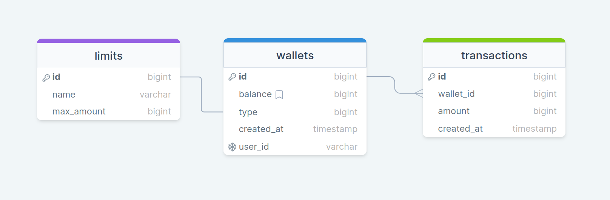

# Тестовое задание на позицию Middle/Senior Go developer в компанию Алиф 

## Задание

Внедрите Rest API для финансового учреждения, где он предоставляет своим партнёрам услуги электронного кошелька. У него есть два типа учетных записей электронного кошелька: идентифицированные и неидентифицированные. API может поддерживать несколько клиентов, и следует использовать только методы http, post с json в качестве формата данных. Клиенты должны быть аутентифицированы через http параметр заголовок X-UserId и X-Digest. X-Digest — это hmac-sha1, хэш-сумма тела запроса. Должны быть предварительно записанные электронные кошельки, с разными балансами, а максимальный баланс составляет 10.000 сомони для неидентифицированных счетов и 100.000 сомони для идентифицированных счетов. Для хранения данных можете использовать по вашему выбору.

API методы сервиса:
1. Проверить существует ли аккаунт электронного кошелька.
2. Пополнение электронного кошелька.
3. Получить общее количество и суммы операций пополнения за текущий месяц.
4. Получить баланс электронного кошелька. 

Во время разработки используйте git и Github и делайте значимые коммиты. Результаты задачи должны быть размещены в вашей учетной записи Github, отправьте нам только ссылку. Мы не принимаем результаты задач в .zip / .rar и т. д. 


## Stack
Golang, PostgreSQL, Nginx
## Cхема базы


## Запуск проекта
> **Комментарии**: При выполнении задания, я исходил из того, что у одного партнера может быть только один электронный кошелёк; данный сервис не занимается созданием пользователя, так как получает X-UserId извне
1. Склонировать репозиторий
```
git clone 
```

2. Перейти в папку проекта
```
cd digital_wallet
```

3. Запустить проект
```
docker compose up -d
```

# Endpoints
## Проверка на существование кошелька
### URL: HEAD - /api/v1/wallets
#### Параметры заголовков
|Свойство        |Тип                            |Описание                     |
|----------------|-------------------------------|-----------------------------|
|X-UserId        |авторизация                    |Уникальный идентификатор партнера|
#### Пример запроса
```
curl HEAD 'http://localhost:80/api/v1/wallets' \
--header 'X-UserId: 36764dc2-2653-4e7f-b24c-430deca66b88'
```
#### Пример ответа в случае успеха
В случае успешного ответа, клиент получает статус код 200. 

#### Пример ответа в случае ошибки
Если такого кошелька не существует, то 404.

## Пополнение кошелька
### URL: POST - /api/v1/wallets
#### Параметры заголовков
|Свойство        |Тип                            |Описание                     |
|----------------|-------------------------------|-----------------------------|
|X-UserId        |авторизация                    |Уникальный идентификатор партнера|
|X-Digest        |авторизация                    |Хеш сумма от тела запроса (HMAC-SHA1) в кодировке Base64    |
> Не забудьте добавить свой секретный токен в **.env** файл
#### Параметры запроса
|Имя        |Тип                            |Описание                     |
|----------------|-------------------------------|-----------------------------|
|amount      |float64                    |Сумма пополнения|

#### Пример запроса
```
curl POST 'http://localhost:80/api/v1/wallets' \
--header 'X-UserId: 36764dc2-2653-4e7f-b24c-430deca66b88' \
--header 'X-Digest: RnkqGygHBJmzXNB+ofYoeLsNIsI=' \
--data '{
    "amount": 100
}'
```
#### Параметры ответа
|Имя        |Тип                            |Описание                     |
|----------------|-------------------------------|-----------------------------|
|error*      |string                    |Возвращается при возникноваении ошибки|

#### Пример ответа в случае успеха
В случае успешного ответа, клиент получает статус код 200. 

#### Пример ответа в случае ошибки
Возможные статус коды в случае ошибки: 400, 401, 404, 500
```
{
    "error": "invalid X-Digest header value"
}
```
## Статистика кошелька за текущий месяц
### URL: GET - /api/v1/wallets/stats
#### Параметры заголовков
|Свойство        |Тип                            |Описание                     |
|----------------|-------------------------------|-----------------------------|
|X-UserId        |авторизация                    |Уникальный идентификатор партнера|
#### Пример запроса
```
curl GET 'http://localhost:80/api/v1/wallets/stats' \
--header 'X-UserId: 36764dc2-2653-4e7f-b24c-430deca66b88' \
```
#### Параметры ответа
|Имя        |Тип                            |Описание                     |
|----------------|-------------------------------|-----------------------------|
|error*      |string                    |Возвращается при возникноваении ошибки|
|number|int|Общее количество пополнений|
|amount|int|Сумма всех пополнений|

#### Пример ответа в случае успеха
В случае успешного ответа, клиент получает статус код 200.
```
{
    "number": 1,
    "amount": 500
}
```
#### Пример ответа в случае ошибки
Возможные статус коды в случае ошибки: 400, 401, 404, 500
```
{
    "error": "wallet not found"
}
```
## Баланс кошелька
### URL: GET - /api/v1/wallets/balance
#### Параметры заголовков
|Свойство        |Тип                            |Описание                     |
|----------------|-------------------------------|-----------------------------|
|X-UserId        |авторизация                    |Уникальный идентификатор партнера|
#### Пример запроса
```
curl GET 'http://localhost:80/api/v1/wallets/balance' \
--header 'X-UserId: 36764dc2-2653-4e7f-b24c-430deca66b88' \
```
#### Параметры ответа
|Имя        |Тип                            |Описание                     |
|----------------|-------------------------------|-----------------------------|
|error*      |string                    |Возвращается при возникноваении ошибки|
|balance|float64|Текущий баланс кошелька|
#### Пример ответа в случае успеха
В случае успешного ответа, клиент получает статус код 200.
```
{
    "balance": 700.65
}
```
#### Пример ответа в случае ошибки
Возможные статус коды в случае ошибки: 400, 401, 404, 500
```
{
    "error": "wallet not found"
}
```